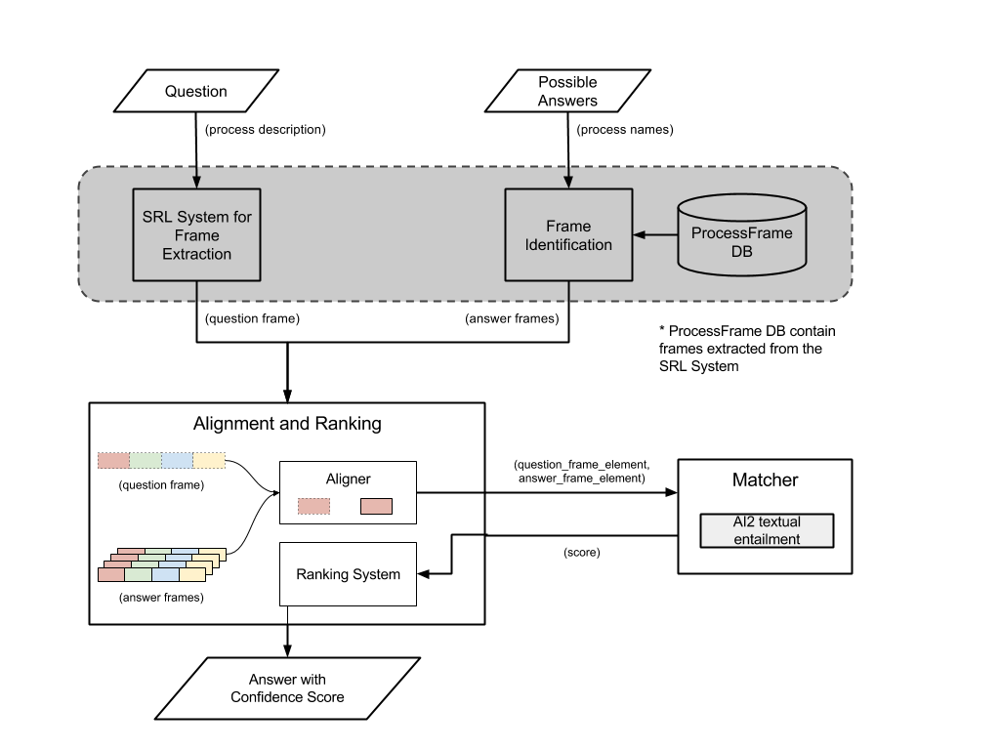

# Question Answering System

### Summary
The goal of this project is to build a question answering system that performs textual reasoning to answer and pass a 4th grade science exam.

#### System Architecture

##### Process Frame
At the 4th grade level, the questions do not involve deep knowledge about the sub-events or their sequential order. Rather the questions test for shallower knowledge about the entities undergoing change, the resulting artifacts, and the main characteristic action describing the process. This knowledge is naturally expressed via semantic roles. Accordingly we design a process frame - simple representation that encodes information about each process via the following roles:

- Undergoer
- Enabler
- Trigger
- Theme
- Result
- Medium
- Source
- Target
- Location
- Direction

##### System Overview
The system takes descriptive question and four answer choices as input. This is then processed by subsystems shown in the following figure to produce an answer and an associated confidence score.

#### Code
The following modules are required to run the system:

  * Python 2.7
  * NumPy
  * Pandas
  * Scipy
  * scikit-learn
  * nltk
  * Matplotlib
  * Requests
  * JSON

and textual alignment service by [AI2](http://allenai.org) (Allen Institute for Artificial Intelligence).
